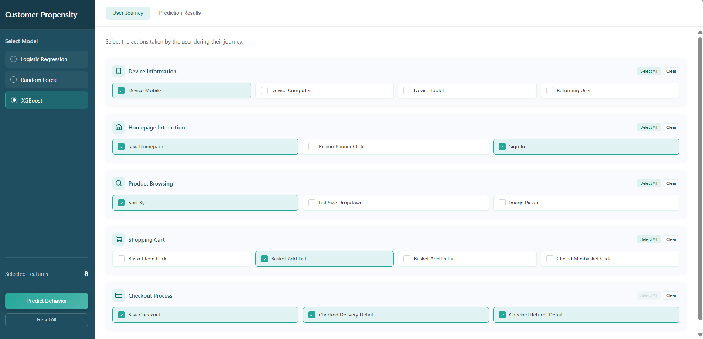
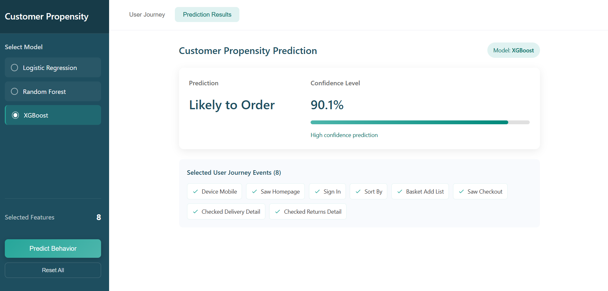

# Customer Propensity Prediction App

A full-stack machine learning project to predict the likelihood of a customer making a purchase on an e-commerce platform, based on their behavioral and session data.

---

## Table of Contents
- [Project Overview](#project-overview)
- [Features](#features)
- [System Architecture](#system-architecture)
- [Tech Stack](#tech-stack)
- [Setup & Installation](#setup--installation)
- [Usage](#usage)
- [Model Details](#model-details)
- [Frontend UI](#frontend-ui)
- [Screenshots](#screenshots)
- [Future Scope](#future-scope)
- [Contributors](#contributors)
- [References](#references)

---

## Project Overview

The Customer Propensity Prediction App is a comprehensive web-based solution that predicts whether a user will place an order, using advanced machine learning models and a modern, interactive frontend. The project covers the full data science lifecycle: data loading, cleaning, EDA, feature engineering, model selection, deployment, and real-time prediction.

---

## Features

- **End-to-end ML pipeline:** Data cleaning, EDA, feature selection, model training, and evaluation in Jupyter/Python.
- **Multiple models:** Logistic Regression, Random Forest, and XGBoost with hyperparameter tuning.
- **Class imbalance handling:** SMOTE and class weighting.
- **Model interpretability:** Feature importance, coefficients, and business-case test scenarios.
- **REST API backend:** Flask app serving predictions and model selection.
- **Modern React frontend:** Grouped feature selection, model selection, real-time prediction, and responsive design.
- **Seamless integration:** Frontend and backend communicate via REST API.

---

## System Architecture

```
Data (CSV) → Data Science Pipeline (Python/Notebook) → Trained Models (.pkl) → Flask API (app.py) → React Frontend (frontend/)
```

- **Data Science:** Customer_Propensity_Production_Demo.ipynb, .py scripts
- **Backend:** app.py (Flask), model files (.pkl)
- **Frontend:** frontend/src/App.js, App.css, index.js

---

## Tech Stack

- **Backend:** Python 3.8+, Flask, scikit-learn, XGBoost, imblearn, numpy, pandas, joblib
- **Frontend:** ReactJS, JavaScript, CSS
- **Other:** Jupyter Notebook, matplotlib, seaborn

---

## Setup & Installation

### 1. Clone the repository
```bash
git clone https://github.com/<your-username>/<repo-name>.git
cd <repo-name>
```

### 2. Python Environment
```bash
python -m venv venv
source venv/bin/activate  # or venv\Scripts\activate on Windows
pip install -r requirements.txt
```

### 3. Node/React Frontend
```bash
cd frontend
npm install
```

---

## Usage

### 1. Start the Backend (Flask API)
```bash
python app.py
```
- Runs at: `http://localhost:5000`

### 2. Start the Frontend (React App)
```bash
cd frontend
npm start
```
- Runs at: `http://localhost:3000`

### 3. Access the App
- Open your browser and go to `http://localhost:3000`
- Select features and a model, then click "Predict Behavior" to get real-time predictions.

---

## Model Details

- **Data:** training_sample.csv (user sessions, behavioral features)
- **Preprocessing:** Dropped redundant/noisy features, handled missing values, class imbalance (SMOTE, class_weight)
- **Models:** Logistic Regression, Random Forest, XGBoost (with GridSearchCV for hyperparameter tuning)
- **Evaluation:** F1-score, confusion matrix, classification report, feature importance
- **Deployment:** Best models saved as .pkl and loaded by Flask API for predictions

---

## Frontend UI

- **Model selection:** Choose between Logistic Regression, Random Forest, XGBoost
- **Feature selection:** Features grouped by user journey stages (device info, homepage, browsing, cart, checkout)
- **Prediction results:** Shows likelihood, confidence, and selected features
- **Responsive design:** Works on desktop and mobile

---

## Screenshots

### User Journey Selection Page


### Prediction Results Page


---

## Future Scope

- Integrate advanced models (e.g., neural networks)
- User authentication and prediction history
- Cloud/SaaS deployment
- SHAP/feature importance dashboards
- Batch prediction and CSV upload support

---

## Contributors

- **22101B0049 – Halim Shaikh**
- **22101B0046 – Amaan Kasu**
- **22101B0062 – Ganesh**
- **Guide:** Prof. Deepali Shrikhande

---

## References

- scikit-learn documentation
- XGBoost documentation
- Flask documentation
- ReactJS documentation

---

> _This project was developed as a mini project for T.E. (Information Technology) at Vidyalankar Institute of Technology, University of Mumbai (2024-25)._